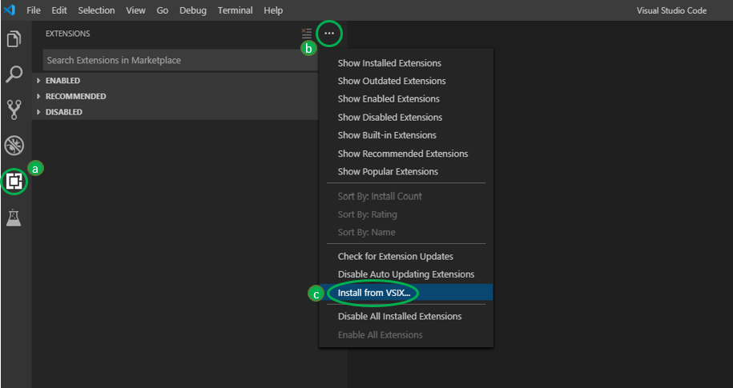

# Instructions on How to Install and Run the Extension

## Steps to manually install the extension

1. Link to the latest releases :
   [Releases](https://github.com/microsoft/vscode-python-embedded/releases)
2. Click on the latest release
3. At the bottom of the page download the .vsix file
4. To install the .vsix file :
   - Go to the directory where the downloaded vsix file is and run in a command console: `code --install-extension <vsix file name>`
   - Or in VS Code, go to the extension tab (a), in menu (b) select 'Install from VSIX' (c) and search the file you downloaded
     

## Prerequisites

_Note: You need to install all the dependencies in order to use the extension._

- [VS Code](https://code.visualstudio.com/Download)
- [Node](https://nodejs.org/en/download/)
- [Python 3.7.4 (or latest)](https://www.python.org/downloads/)
  - **Warning :** Make sure you've included `python` and `pip` to your `PATH` in your **environment variables**.  
  _(Note: the easiest way to do it might be when you install Python, you can select the "Add to PATH" option directly. Otherwise you can search how to insert it manually, but make sure that when you type `python` in a terminal, the command is recognized.)_
- Python VS Code extension (download from VS Code Marketplace)
- Simple audio :
  - `python -m pip install --upgrade pip`
  - `pip install simpleaudio`
  - **Troubleshoot :** If it's not working make sure you have pip and C++ 2015 build tools installed ([Download link](https://visualstudio.microsoft.com/vs/older-downloads), and look under 'Redistributables and Build tools' : 'Microsoft Build Tools 2015')
- Pywin32 : `pip install pywin32`

## How to use the Extension

- [How to use the Extension](/docs/how-to-use.md)
